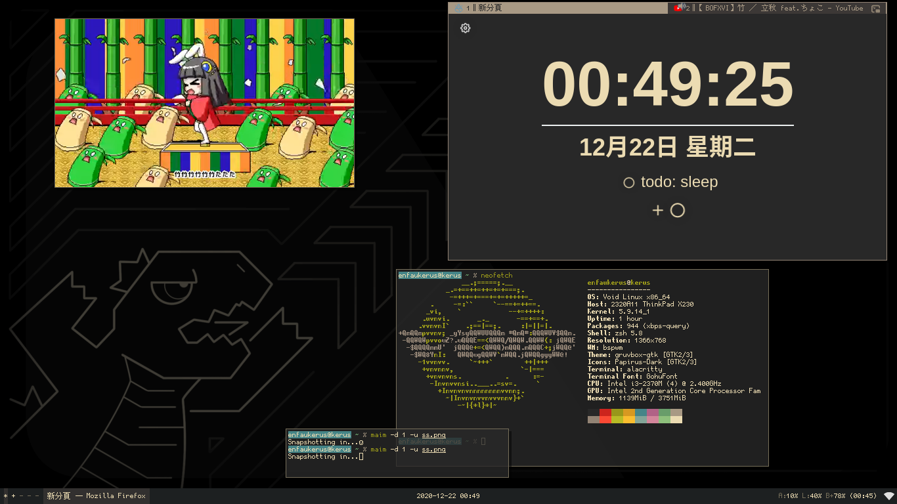

## Greetings.
he/him, internet furry 🐺, college student  

![OS: Void Linux][void-linux]
![Shell: Zsh][zsh]  
![Language: Shell Script][shell-script]
![Language: C#][c-sharp]
![Language: Python][python]   
![Tools: Docker][docker]
![Tools: MariaDB][mariadb]
![Tools: Nginx][nginx]  
![Editor: VSCode][vscode]
![Editor: neovim][neovim]  

---

[void-linux]: https://img.shields.io/static/v1?logo=data:image/png;base64,iVBORw0KGgoAAAANSUhEUgAAABgAAAAYCAYAAADgdz34AAACCklEQVRIx52WwUsVURTGv/NMeYmSTw0jCP8AC1xGkYUR7lyIm2hR29a1qm3bkCiinaL2JHDT4m1K27lwE4+3iAqCbBNZCqH4FH3+3NzschzHmXdgYO453/m+O2fOnDumFAMuSLotaVjSgKRzkpC0KumTpA+S5sxsRXkMOA9MAbucbHvAbNhMZoFJ8ttfYDyrQBvw1hH8Bj6Ga/UYkX3gfh6ReeAlMAiYi18CngM7TqQBjHqys0AF6FJOAwaAL05kDeiLQS9CYBk404RIH/DVibz6F+wGtqLAki9HRpFB13V1oLcgaUzS6Qj7zcxwyZ3Ak/CEy+G+M8aYWVXSTOQqShpT6OHYhhx5B1BN6Jgq0OGwVx2mLKAWOXaAVpf0OKX3HznsKWA7itcKkkoRZsXMdl15R1JKP+LKtCfpe+QqFcJsOcQkkDRSBPYTfC3xoiBpPVr3A20uoZIiUPEfp6T+yLUmYNrV9YZLKobW9bYEFB122GGmBdw78uaP9ngReAC8C9dDTx5wbxzXXQFdwKabJVfUhAHvI56Nw6kATDjlH7nm+3+BdmAhcDyNA93AzwSRy02KvAZKPnAz4QRrADPAtfgDBFqB60A57Lg9q/qdlGOyDnwOo3nbxRbziNwCfjVxZJbz1LE3nBH1DMRbwDOgJ4nLThKSNB5+Wy5K6gk5fyTVwm/LvJmtH8dxAD7c393ZOP+dAAAAAElFTkSuQmCC&label=OS&message=Void%20Linux&color=467f60&style=flat-square
[zsh]: https://img.shields.io/static/v1?label=%25%20Shell&message=zsh&color=blue&style=flat-square
[shell-script]: https://img.shields.io/static/v1?logo=gnu-bash&logoColor=white&label=Language&message=Shell%20Script&color=yellow&style=flat-square
[c-sharp]: https://img.shields.io/static/v1?logo=c-sharp&logoColor=white&label=Language&message=C%23&color=239120&style=flat-square
[python]: https://img.shields.io/static/v1?logo=python&logoColor=white&label=Language&message=Python&color=3776ab&style=flat-square
[docker]: https://img.shields.io/static/v1?logo=docker&logoColor=white&label=Tools&message=Docker&color=2496ed&style=flat-square
[mariadb]: https://img.shields.io/static/v1?logo=mariadb&logoColor=white&label=Tools&message=MariaDB&color=003545&style=flat-square
[nginx]: https://img.shields.io/static/v1?logo=nginx&logoColor=white&label=Tools&message=nginx&color=269539&style=flat-square
[vscode]: https://img.shields.io/static/v1?logo=visual-studio-code&logoColor=white&label=Editor&message=VSCode&color=007acc&style=flat-square
[neovim]: https://img.shields.io/static/v1?logo=neovim&logoColor=white&label=Editor&message=neovim&color=57a143&style=flat-square

